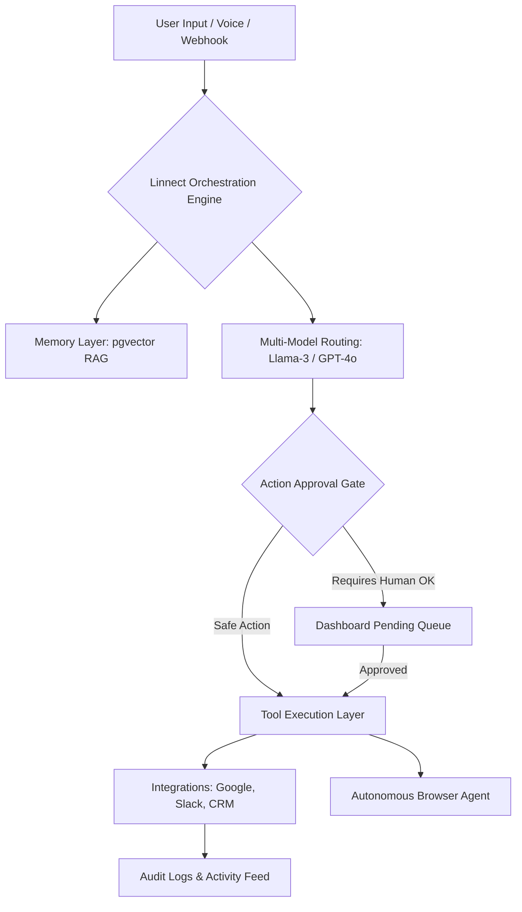

# Assist Pro 🛸💎

**Assist Pro is an AI-powered productivity engine designed to reclaim human time by automating mundane workflows with absolute precision.** By acting as a secure "Human-in-the-Loop" orchestration layer, it integrates seamlessly with your favorite tools (Google Workspace, Slack, Notion, HubSpot, Zoom) to turn natural language instructions into concrete, trackable, and safe actions across your digital ecosystem.

---

## 🚀 Overview

This repository serves as the **official documentation and public resource hub** for Assist Pro. 

> [!NOTE]
> **This repository contains documentation, API guides, and integration demos ONLY.**
> The Assist Pro core engine and proprietary automation logic are maintained in private infrastructure to ensure maximum security and IP protection for our users.

### Product Interface

*(Note to maintainers: Upload real images to `/assets/screenshots/`)*

## 🚀 Real Workflows in Action

### 1. The Meeting Follow-up
*User Prompt:* "Send a follow-up email to the team from the 10 AM sync, summarize the main points, and create a task in Notion for the Q3 roadmap."
*Action:* AI queries Google Calendar for the 10 AM attendees, generates a customized email using your Digital Twin style, drafts the email for your approval, and automatically initializes a new page in the Notion roadmap database.

### 2. The Lead Generation Pipeline
*User Prompt:* "Find 5 software companies in Austin using the web agent, extract the CEO's contact info, and draft a personalized intro."
*Action:* AI spins up a secure browser agent, scrapes targets, cross-references with your HubSpot CRM to prevent duplicates, adds the new contacts, and queues 5 tailored email drafts for human approval.

### 3. The Proactive Opportunity Spotter
*Background Trigger:* The cron engine notices an unread high-priority email from a key client and a conflicting calendar event.
*Action:* AI flags the conflict in Slack, proposes a rescheduled time block, and drafts an apology email for your review—all before you open your laptop.

---

## 🏗️ High-Level Architecture

---

## 📚 Official Documentation

Explore the inner workings of Assist Pro:

- 📖 **[Architecture Deep Dive](./docs/architecture.md)**
- 🛡️ **[Security & Trust Center](./docs/security.md)**
- 🔄 **[Workflow Examples](./docs/workflows/)**
- 🔌 **[Integration Capabilities](./docs/integrations/)**
- 💻 **[API & Webhook Examples](./examples/)**

### Links
[**Landing Page & Demo**](https://www.assistpro-driftsphere.com/) | [**Pricing**](https://www.assistpro-driftsphere.com/pricing) | [**Login**](https://www.assistpro-driftsphere.com/sign-in)
